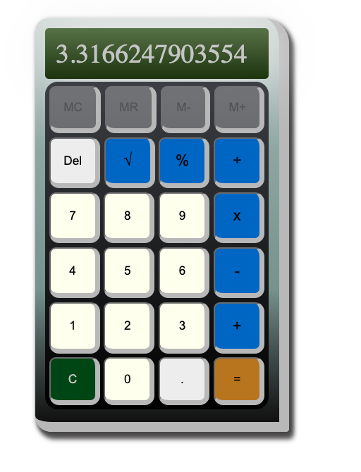

# The infamous Calculator Project

## Decription

A simple calculator, that can add/subject, multiply/divide like magic. Follows MDAS order of operations.

## Screenshots

## Motavation

Was curious how hard it would be to build a calculator from scratch a year after being in the bootcamp myself, while the student were doing the exercise themselves to learn about event handlers and maniputlating the DOM using JavaScript.

## Tech Used
- JavaScript
- CSS3
- HTML5